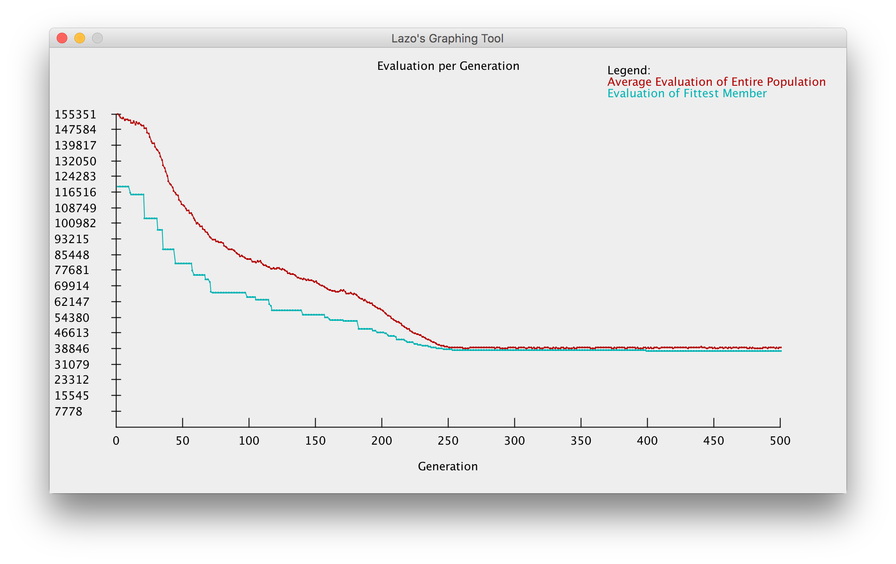

# Genetic-Algorithm-for-the-Traveling-Salesman-Problem
A population based stochastic algorithm for solving the Traveling Salesman Problem.


The settings and results are as follows:

```
Seed: -5895073454024526343
----------Genetic Algorithm Properties----------
Number of Cities:   48
Population Size:    500
Max. Generation:    500
k Value:            3
Elitism Value:      1
Force Uniqueness:   false
Local Search Rate:  0.0
Crossover Type:     UNIFORM_ORDER
Crossover Rate:     90.0%
Mutation Type:      INSERTION
Mutation Rate:      4.0%
-----------Genetic Algorithm Results------------
Average Distance of First Generation:  157724
Average Distance of Last Generation:   36070
Best Distance of First Generation:     122547
Best Distance of Last Generation:      34873
Area Under Average Distance:           32335049
Area Under Average Distance:           26186089
```

Also produces a graph with the progress over time:



This program is also capable of producing a 2D heat map for determining the optimal parameters but I have not included an image of this.

## Usage
Navigate to Main.class after compiling and run the following command:
```
java Main
```
